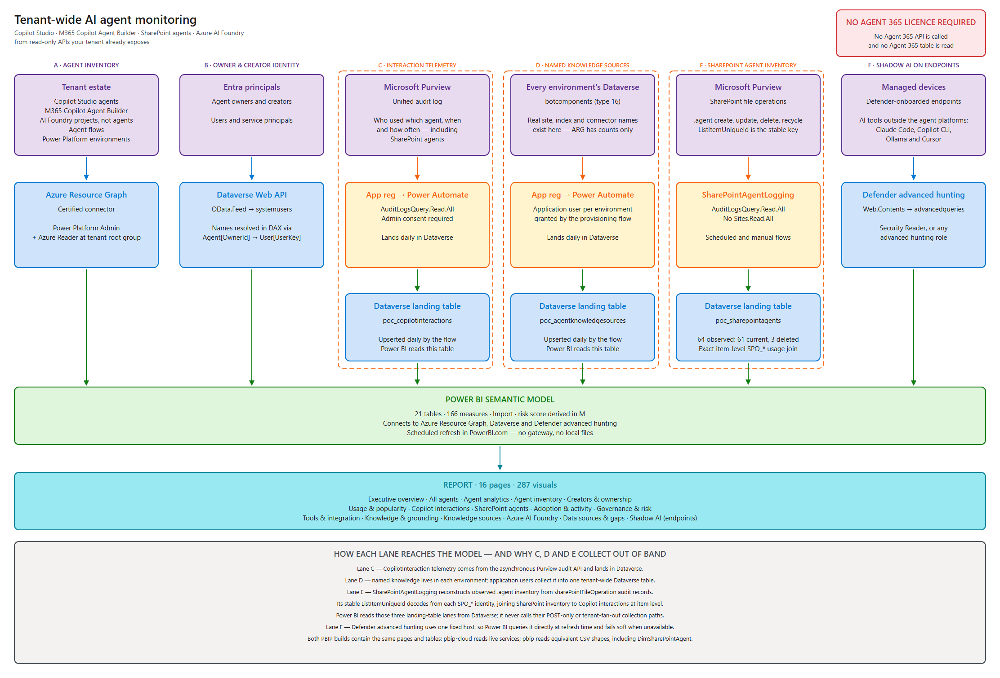
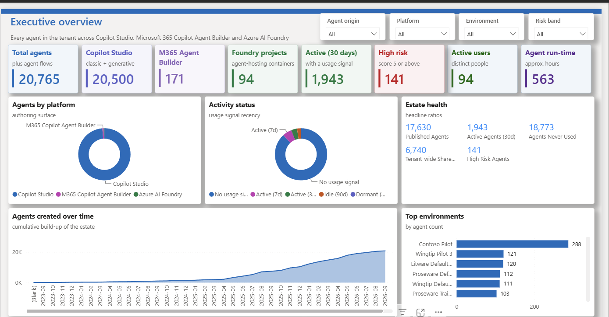
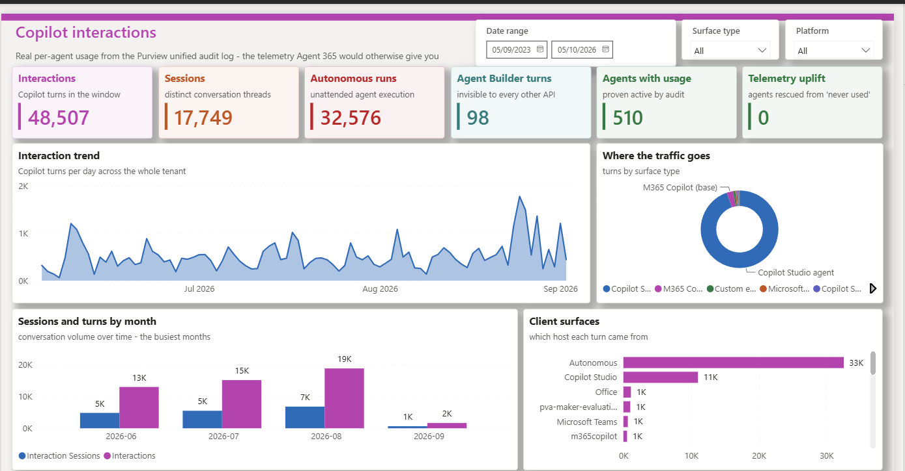
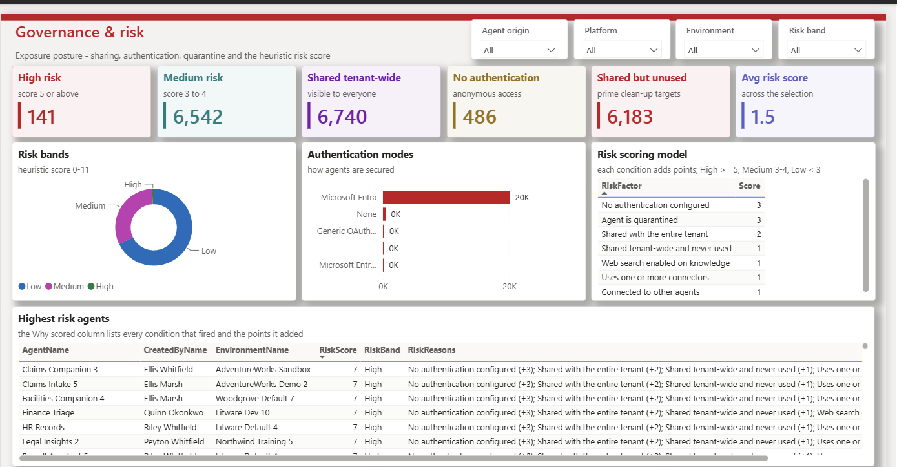
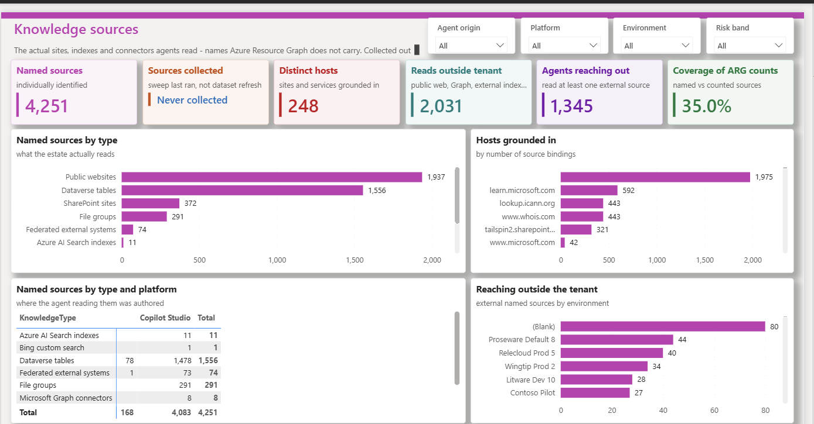

# Agent Inventory

Agent 365–style tenant agent monitoring, without Agent 365.

A tenant-wide monitoring and governance solution for **Microsoft 365 Copilot Agent Builder**, **Copilot Studio**, **agent flows** and **Azure AI Foundry** — built entirely on APIs available to a normal Power Platform / Azure administrator, with **no Agent 365 licence**.

Two Power BI builds of one semantic model — **21 tables, 166 measures, 16 pages, 287 visuals** in each:

| Deliverable | Path | What it is |
|---|---|---|
| **Power BI project (cloud)** | `pbip-cloud\AgentInventory.pbip` | The maintained deliverable. Live connections to Azure Resource Graph, Dataverse and Defender advanced hunting, so it refreshes on a schedule in PowerBI.com with **no gateway**. |
| **Power BI project (CSV)** | `pbip\AgentInventory.pbip` | The same model and the same report, reading CSV files from a folder instead. For offline or air-gapped review. |
| **Power BI template** | `template\Agent Inventory.pbit` | A single-file template of the report. Open it in Power BI Desktop, enter the parameters when prompted, and it loads against your own tenant. |
| **Power Platform solutions** | `solution\*.zip` | Importable Dataverse solutions for interaction telemetry, named knowledge sources and SharePoint agent inventory, plus the flow that provisions the application users lane D depends on. |
| **Anonymised sample data** | `sample-data\agent365-sample-data.zip` | A full demo-tenant extract, every identifying value replaced, so the CSV build opens with real-shaped data and no tenant access. |

Verified end-to-end against a live Microsoft 365 test tenant.

> **Evaluating this as an Agent 365 alternative?** Start with **[Required permissions](#required-permissions)** — it lists exactly what each data source needs, who has to grant it, and what you still get if you decline any part of it. Everything is read-only; nothing here can create, change or control an agent.
>
> **Deploying it?** Follow the **[deployment guide](docs/deployment.md)** — prerequisites, app registrations, environment variables, and how the service principal is provisioned into every environment.

---

## Quick start

**To report on your own tenant** — open `pbip-cloud\AgentInventory.pbip` in Power BI Desktop, publish
it to a workspace, set the three data-source credentials to *Organizational account*, and set a
refresh schedule. Permissions are listed under [Required permissions](#required-permissions);
the three collected lanes are turned on by importing the solutions in `solution\`.

**To just look at the report** — unzip `sample-data\agent365-sample-data.zip`, open
`pbip\AgentInventory.pbip`, and point its `DataFolder` parameter at the unzipped `data` folder. No
credentials, no Azure permissions, no tenant access. See [`sample-data\README.md`](sample-data/README.md).

---

## Architecture



Six lanes feed one semantic model:

| Lane | Collects | How it is collected | What the model connects to |
|---|---|---|---|
| **A** — agent inventory | Copilot Studio, Agent Builder, Foundry, agent flows, environments | Power BI queries ARG at refresh time | **Azure Resource Graph** connector |
| **B** — owner & creator identity | Display names for owners and creators | Power BI queries Dataverse at refresh time | **Dataverse** connector → `systemusers` |
| **C** — interaction telemetry | Per-turn Copilot usage from the Purview audit log, including SharePoint agents | A **Power Automate cloud flow** runs daily and writes rows into Dataverse | **Dataverse** connector → `poc_copilotinteractions` |
| **D** — named knowledge sources | The real sites, indexes and connectors agents are grounded on | A **sweep** reads `botcomponents` in every environment and writes one landing table | **Dataverse** connector → `poc_agentknowledgesources` |
| **E** — SharePoint agent inventory | `.agent` files observed across SharePoint, with current/deleted state, names, sites and URLs | A separate **Power Automate cloud flow** reconstructs latest state from SharePoint file-operation audit records | **Dataverse** connector → `poc_sharepointagents` |
| **F** — shadow AI on endpoints | Unsanctioned AI desktop tools on managed devices — Claude Code, Copilot CLI, Ollama, Cursor | Power BI queries **Defender advanced hunting** at refresh time | **Web** connector → `api.security.microsoft.com` |

**The semantic model only ever talks to three connectors: Azure Resource Graph, Dataverse and the Defender advanced hunting API.** It never calls Purview, never calls Power Automate, and never touches the 500-plus per-environment Dataverse endpoints. Lanes C, D and E are *collectors*, not data sources: they run on their own schedule, outside the dataset refresh, and deposit rows into the one Dataverse the model reads like any other table. That indirection is what keeps the whole solution gateway-free.

> Lanes A, B and F need nothing installed. Lanes C and E can reuse one `AuditLogsQuery.Read.All` app registration; lane D uses its own Dataverse application user. See [Out-of-band collection lanes](#out-of-band-collection-lanes-c-d-and-e).


### Star schema

| Table | Grain | Rows |
|---|---|---|
| `Agent` | one row per agent per environment (unified across all three platforms) — see [The Foundry rows are projects, not agents](#the-foundry-rows-are-projects-not-agents) | 20,764 |
| `Environment` | Power Platform environment | 769 |
| `AgentConnector` | agent × connector binding (carries `IsMcpServer`) | 6,357 |
| `AgentKnowledge` | agent × knowledge source type, from `componentsCounts.knowledgeByType` plus web search. The **only** integration surface Agent Builder agents have — they carry no connectors, tools, flows or triggers at all | 7,982 |
| `KnowledgeSource` | agent × **named** knowledge source — the actual SharePoint site, website, Graph connector or Azure AI Search index, swept from each environment's Dataverse. Copilot Studio only; see [Lane D](#lane-d--named-knowledge-sources) | ~4,300 |
| `SharePointAgent` | one row per `.agent` file observed in the configured Purview audit-retention window; latest operation determines current/deleted state | 64 |
| `AgentFlow` | agent flow / M365 agent flow | 565 |
| `AzureAIResource` | Azure AI / Foundry resource | 298 |
| `User` | Entra principal resolved from Microsoft Graph, used to name creators and owners | 114 |
| `Interaction` | one row per Copilot turn from the Purview unified audit log | 48,510 |
| `CopilotSurface` | one row per distinct `AppIdentity` seen in the audit log, classified into a surface type | 744 |
| `TelemetryCoverage` | which agents have audit telemetry, and which are invisible to it | 20,764 |
| `RiskFactor` / `RiskDetail` | the risk rubric, and the per-agent reasons behind each score | reference |
| `ApiCoverage` / `AgentGap` | which APIs were reachable, and what Agent 365 gives you that they do not | reference |
| `Date` | date dimension, marked as the model's date table | 1,127 |
| `Metrics` | measure-only table (166 measures, 12 display folders) | 1 |

Relationships: `Agent[EnvironmentId] → Environment`, `AgentConnector[AgentKey] → Agent`, `AgentKnowledge[AgentKey] → Agent`, `KnowledgeSource[AgentKey] → Agent`, `AgentFlow[EnvironmentId] → Environment`, `Agent[CreatedById] → User`, `Agent[OwnerId] → User`, `Interaction[SurfaceKey] → CopilotSurface`, `Interaction[AgentKey] → Agent`, `CopilotSurface[SharePointAgentKey] → SharePointAgent`, `Interaction[Date] → Date` (active), `Agent[CreatedDate] → Date` and `Agent[LastUsedDate] → Date` (both inactive, driven by `USERELATIONSHIP`).

> The two `Agent → Date` relationships **must** be inactive. `Interaction` is the fact table that owns the date grain, so leaving `Agent[CreatedDate]` active creates two paths from `Interaction` to `Date` — one direct, one via `Agent` — and Power BI Desktop refuses to load an ambiguous model.

### Agent origin

Roughly five in six agents in this tenant were provisioned by the platform, not authored by a person. Left in, they swamp every ranking, distribution and trend. The `Agent[AgentOrigin]` calculated column splits the estate three ways and is exposed as the first slicer on every page:

| Origin | Agents | Meaning |
|---|---|---|
| Platform-provisioned | 17,296 | the inventory API reports the null creator GUID — default environment scaffolding, template copies, system bots |
| Human-built | 3,374 | creator resolved to a real Entra principal |
| Creator unknown | 94 | no creator recorded at all. Every one is an Azure AI Foundry project: the Foundry control plane simply does not return one |

"Creator unknown" is deliberately **not** folded into either of the other two. Counting it as human inflates the creator league table with agents nobody claims; counting it as platform hides a real API gap.

### Risk heuristic

| Factor | Score |
|---|---|
| No authentication configured | +3 |
| Agent is quarantined | +3 |
| Shared with the entire tenant | +2 |
| Shared tenant-wide **and** never used | +1 |
| Web search enabled on knowledge | +1 |
| Uses one or more connectors | +1 |
| Connected to other agents | +1 |

Bands: **High ≥ 5**, **Medium 3–4**, **Low < 3**. Implemented identically in PowerShell (CSV mode) and Power Query (Live mode).

### CSV mode vs Live mode

The semantic model has a `SourceMode` parameter:

- **`Csv`** (default) — reads `data\*.csv` via the `DataFolder` parameter. Fast, no auth prompts, refreshes anywhere.
- **`Live`** — queries Azure Resource Graph directly from Power Query.

---

## What it reports on

Current tenant snapshot — live Azure Resource Graph, **4 September 2026**:

| Metric | Value |
|---|---|
| Total agent surface | **21,329** |
| Copilot Studio agents | 20,499 |
| M365 Copilot Agent Builder agents | 171 |
| Azure AI Foundry projects | 94 |
| Agent flows | 565 |
| Power Platform environments | 769 |
| Azure AI resources | 298 |
| Active in last 30 days | 2,024 (9.7%) |
| Never used | 18,302 |
| Shared with entire tenant | 6,740 |
| Unauthenticated | 486 |
| Quarantined | 2 |
| High risk | 141 |
| Connector bindings | 6,357 |
| **MCP server bindings** | **1,666** (75 distinct MCP servers, 1,469 agents) |
| Distinct agent creators (resolved to real names) | 114 |
| Human-authored agents | 3,374 |
| Platform-provisioned agents | 17,296 |
| Agents with no recorded creator | 94 |
| **Copilot interactions (Purview audit)** | **48,507** across 94 users and 17,749 threads |
| Autonomous interactions | 67% — no human in the loop |
| Agents given a usage signal only by the audit log | 469 |

---

## The report

Fifteen pages. Every screenshot below is rendered from the **anonymised sample
dataset** in [`sample-data\`](sample-data/), not from a live tenant — the shapes,
volumes and distributions are real, the names are not. Download the sample and
you get exactly these pages.

### Executive overview

The whole estate on one page: how many agents exist, who is authoring them, which
platform they live on, and how much of the estate has ever actually been used.



### Agent inventory

The full register — every agent with its creator, owner, environment, orchestration
mode, model, authentication and risk band. Sortable, and driven by the slicers.


### Copilot interactions

Real per-agent usage from the Purview unified audit log. This is the page that
recovers the telemetry Agent 365 would otherwise be the only source of — including
autonomous runs, which no other API reports, and SharePoint agents, which no
inventory API reports at all.



### Governance & risk

Exposure posture — tenant-wide sharing, unauthenticated agents, quarantine and a
transparent heuristic score. The `RiskReasons` column lists every condition that
fired and the points it added, so no number is unexplainable.



### Knowledge sources

What agents actually read: SharePoint sites, public websites, Dataverse tables,
Graph connectors and Azure AI Search indexes, named rather than merely counted.



### Azure AI Foundry

The Azure-side estate that hosts Foundry Agent Service agents, with regions, SKUs
and public-network exposure.


The remaining nine pages — All agents, Agent analytics, Creators & ownership,
Usage & popularity, Adoption & activity, Tools & integration, Knowledge & grounding,
Data sources & gaps and Shadow AI (endpoints) — are in the build. Shadow AI is
deliberately empty in the sample; see
[Shadow AI on managed endpoints](#shadow-ai-on-managed-endpoints).

---

## Data sources

### Azure Resource Graph — `PowerPlatformResources`

The whole solution rests on a single, largely undocumented Azure Resource Graph table.

```http
POST https://management.azure.com/providers/Microsoft.ResourceGraph/resources?api-version=2021-03-01
Content-Type: application/json

{ "query": "PowerPlatformResources | where type =~ 'microsoft.copilotstudio/agents' | ...",
  "options": { "resultFormat": "objectArray", "$top": 1000 } }
```

This returns **every agent in the tenant, across every environment, in one query** — no per-environment iteration, no Dataverse calls, no Agent 365 licence. Resource types available:

| Type | Rows here |
|---|---|
| `microsoft.powerplatformusage/usagerecords` | 32,299 |
| `microsoft.copilotstudio/agents` | 20,670 |
| `microsoft.powerautomate/cloudflows` | 10,136 |
| `microsoft.powerapps/modeldrivenapps` | 9,636 |
| `microsoft.powerplatformconnector/connectors` | 1,636 |
| `microsoft.powerapps/canvasapps` | 837 |
| `microsoft.powerplatform/environments` | 769 |
| `microsoft.powerautomate/agentflows` | 559 |
| `microsoft.powerapps/codeapps` | 129 |
| `microsoft.powerplatform/environmentgroups` | 78 |
| `microsoft.powerapps/apps` | 19 |
| `microsoft.powerautomate/m365agentflows` | 6 |

Those 12 types are the whole of `PowerPlatformResources`, and **only one of them holds agents** — which is the first of the three checks behind [Is the inventory complete?](#is-the-inventory-complete).

A tenant-wide census — `mv-expand bag_keys(properties)` across all 20,670 agents, not a sample — shows the resource carries **exactly 31 properties**:

`displayName, createdIn, createdAt, createdBy, ownerId, environmentId, schemaName, lastPublishedAt, lastUsed, orchestration, model, authentication, channels[], triggers[], flows[], isQuarantined, quarantinedAt, isManaged, isGithubCopilotAgent, isCLIAgent, isWebSearchEnabledForKnowledge, entraAppId, entraAgentId, entraAgentBlueprintId, harness, instructionsCharactersCount, componentsCounts{topics,tools,knowledge,connectedAgents,knowledgeByType{…}}, capabilitiesCounts{…}, sharedWithViewers{userCount,groupCount,entireTenant}, sharedWithEditors{…}, powerPlatformConnectors[{connectorId,operations[]}]`

That census is the reason the *Agent 365 gap* table above can be stated as fact rather than guessed at: if an attribute is not in that list, no ARG query will produce it.

**Four critical field-level findings:**

1. **`createdIn = "Copilot Studio Lite"` identifies M365 Copilot Agent Builder agents.** This is the only way found to separate Agent Builder from Copilot Studio without Agent 365 or Graph scopes `az` cannot issue. `microsoft.copilotstudio/agents` covers both surfaces — 20,497 Studio and 171 Lite.
2. **`powerPlatformConnectors[].operations[]` entries carry `"type": "MCP"`** — this is how MCP server tool usage is detected across the tenant. Match it with `matches regex '"type":"MCP"'`, **not** `contains`: ARG's `contains` operator works on a tokenised form of the string and silently matches nothing when the needle contains punctuation. Measured over all 6,250 connector bindings, `contains '"type":"MCP"'` returned **0** while `matches regex` and `has` each returned exactly the 1,666 that an `mv-expand`/`op.type == 'MCP'` ground-truth pass returns.
3. **`entraAgentId` is not `entraAppId`.** The latter is the app registration; the former is the agent's own Entra identity and is the one the Agent 365 registry displays. Both are now collected — 7,226 agents carry an `entraAgentId`.
4. **`componentsCounts.knowledgeByType` is a bag, not a fixed schema.** Enumerating its keys tenant-wide yields `graphConnectors, dataverseSources, publicSites, files, fileGroups, sharepointSites, powerPlatformConnectors, bingCustomSearch, teamsMessages`. The collector flattens it, which is what makes Graph connector exposure reportable at all.

Pagination: 1,000 rows per page; follow `$skipToken` from the response and pass it back in `options.$skipToken`.

### What the collectors call

These are the only endpoints the solution uses. None is licence-gated.

| Lane | Endpoint | Gives you |
|---|---|---|
| A | ARG `PowerPlatformResources` | Agent inventory, configuration, `lastUsed` |
| A | ARG `resources` (CognitiveServices / MachineLearningServices) | Azure AI Foundry estate |
| B | Dataverse `systemusers` | Owner and creator names |
| C | Graph `/security/auditLog/queries` | `CopilotInteraction` audit records |
| D | Dataverse `botcomponents` where `componenttype eq 16` | Named knowledge sources |
| E | Graph `/security/auditLog/queries` with `sharePointFileOperation` + `.agent` | Observed SharePoint agent inventory and latest state |
| F | Defender `DeviceTvmSoftwareInventory` | AI tools installed on managed devices |
| F | Defender `DeviceProcessEvents` (30d) | AI tools actually executed, including CLI tooling |
| F | Defender `DeviceNetworkEvents` (30d) | Devices talking to an AI endpoint |

Lanes C, D and E are not read at refresh time — they land their output in Dataverse first. Lane F *is* read at refresh time, like lanes A and B. See [Architecture](#architecture).

---

## What Agent 365 gives you that this does not

| Capability | This solution | Agent 365 |
|---|---|---|
| Tenant-wide agent inventory | ✅ | ✅ |
| Agent Builder vs Copilot Studio split | ✅ (`createdIn`) | ✅ |
| Per-agent last-used telemetry | ✅ | ✅ |
| Connector / MCP-server exposure | ✅ | ✅ |
| Sharing + authentication posture | ✅ | ✅ |
| Azure AI Foundry estate | ✅ | Partial |
| Per-agent message / session volume | ✅ via Purview audit log | ✅ |
| Purview integration for agent activity | Partial — read-only audit log | ✅ full eDiscovery |
| **Per-agent cost metering** | ❌ | ✅ |
| Per-agent Entra Agent ID identity records | ✅ ID + blueprint ID, no sign-in history | ✅ |
| **Conversation-level content + DLP inspection** | ❌ | ✅ |
| **Agent lifecycle actions (block, quarantine, retire)** | ❌ read-only | ✅ |
| **Cross-workload agents (SharePoint, Teams, Security Copilot)** | Partial — SharePoint inventory and usage are covered within audit retention; Teams and Security Copilot inventory are not | ✅ |
| Shadow AI — unsanctioned AI tooling on endpoints | ✅ via Defender advanced hunting, needs Defender for Endpoint | ✅ |
| **Agent 365 licence required** | **No** | Yes |

**Summary:** this covers *discovery, inventory, adoption, usage volume and exposure posture* very well. It cannot cover *identity, content inspection, cost metering, or enforcement* — those are the genuine Agent 365 differentiators.

### Why not just use the Graph agent registry API?

There is a Microsoft Graph API that does exactly what the inventory lane here does, and it is GA on `v1.0`:

```http
GET https://graph.microsoft.com/v1.0/copilot/admin/catalog/packages
  ?$filter=platform eq 'Microsoft 365 Copilot Agent Builder'
```

It takes `CopilotPackages.Read.All` (delegated or application), returns declarative agents, custom-engine agents and bots across Copilot, Teams, Outlook and M365, and filters by `platform` and `elementTypes` — a cleaner inventory than assembling one from Azure Resource Graph.

It is not used here for one reason, stated plainly in its own reference page:

> Access to the Package Management API requires a **Microsoft Agent 365** license.

So it is not an alternative route to the same place; it sits behind the very licence this project exists to work without. The Azure Resource Graph lane reaches the same agents with a Power Platform Administrator or Global Reader role and no licence, which is why it is the one wired up. If you *do* hold Agent 365 licences, that Graph endpoint is the better inventory source and this report's ARG lane becomes redundant — the rest of it (audit-log volume, knowledge sources, Shadow AI) does not.

### Mirroring the Agent 365 console

Three pages exist specifically to sit alongside the Agent 365 UI so the same questions can be answered without the licence:

| Page | Mirrors | Carries |
|---|---|---|
| **Shadow AI (endpoints)** | the Agent 365 Shadow AI tab | unsanctioned AI tooling found on Defender-managed devices across three detection layers, with a devices-per-tool bar chart, a category donut, the full detection list, the affected devices, and the watchlist itself so an empty page reads as *none present* rather than *nothing was checked*. See [Shadow AI on managed endpoints](#shadow-ai-on-managed-endpoints) |
| **All agents** | the Agent 365 agent registry list | four slicers (platform, environment, risk, status) over a master **Agent registry** table, two detail panels — environment/ownership/sharing and data/tools — and an **Activity mix by platform** bar chart. Selection flows one way only: picking a row in the registry drives both panels, while the panels filter nothing back, so the master list never collapses to the row you just clicked. The chart works the other way round, acting as a one-click filter on the registry, and the header KPI cards deliberately ignore all of it and keep describing the slicer-filtered population |
| **Agent analytics** | the Agent 365 analytics tab | active users, sessions, run-time and instruction coverage, plus agents by creator, top platforms, trending agents by active user count, and active users over time |

The *Executive overview* KPI strip gained **Active users** and **Agent run-time** to match the Agent 365 landing cards.

Four things the Agent 365 detail pane shows are **not** reachable this way, and no amount of collector work will change that:

| Attribute | Why not |
|---|---|
| Agent description | absent from Azure Resource Graph *and* from the Dataverse `bot` table — there is no `description` column |
| Publisher / publisher type | Agent 365 catalogue metadata, licence-gated |
| Shared with — named users | ARG returns only `{groupCount, userCount, entireTenant}`, never the principals |
| Sensitivity label | not exposed on the agent resource |

**Instructions text** and the **"Can read" capability chips** (`webBrowsing`, `codeInterpreter`) *are* obtainable, but only from Dataverse `botcomponent` where `componenttype eq 15` — the `data` field is YAML carrying `instructions:`, `knowledgeSources:` and `gptCapabilities:`. That needs a per-environment sweep like [lane D](#lane-d--named-knowledge-sources) and is not wired up. The collector does surface `InstructionsCharCount` and `HasInstructions` from ARG, so instruction *coverage* is reportable without it.

#### Run-time is an estimate, and deliberately a conservative one

Nothing in ARG or the audit log records how long an agent worked — only when it was used. `Agent Run-time (hours)` therefore sums the elapsed time within each conversation **on each calendar day**.

The per-day grouping is the whole trick. A Teams `ThreadId` survives for months, so measuring a thread end to end is meaningless: on this tenant's data the longest single thread spanned **2,116 hours** and the naive total came to 8,863 hours. Grouping by thread *and* day caps the longest group at 8.0 hours and lands at **465 hours**, which is **0.81×** a rigorous capped-inter-message-gap estimate over the same data. Read it as a floor, not as a like-for-like match with the Agent 365 figure.

### No part of this needs an Agent 365 licence

Every endpoint the two collectors actually call is listed in the [the endpoint list](#what-the-collectors-call) and none is licence-gated. The two Agent-365-gated endpoints that do exist — `GET /copilot/admin/catalog/packages` and `GET /beta/copilot/agents` — appear **only** as documented `Blocked (403)` rows in the `ApiCoverage` reference table on the *Data sources & gaps* page. They are evidence of the gap, not a data source; no measure, column or visual reads from them.

---

## Is the inventory complete?

"Complete" is a claim worth testing rather than assuming, so this section records how it was tested and where it genuinely falls short. Verified live against Azure Resource Graph on **4 September 2026**.

| Platform | Inventory claim | Verdict |
|---|---|---|
| Copilot Studio | 20,499 agents | **Complete** — tenant-wide |
| M365 Copilot Agent Builder | 171 agents | **Complete** — tenant-wide |
| Azure AI Foundry | 94 rows | See [The Foundry rows are projects, not agents](#the-foundry-rows-are-projects-not-agents) |

### Why Copilot Studio and Agent Builder are complete

Three independent checks, each of which would have exposed a missing bucket:

1. **Only one resource type holds agents.** `PowerPlatformResources` exposes 12 types; the other 11 are flows, apps, connectors, environments and usage records. Nothing is hiding in a sibling type.
2. **`createdIn` has exactly two values and they sum to the total with nothing left over** — 20,499 Copilot Studio + 171 Copilot Studio Lite = 20,670. No blanks, no null bucket, no undiscovered third authoring surface.
3. **The lane is not RBAC-scoped.** Power Platform Administrator (or Global Reader) returns the whole tenant, so unlike the Foundry lane there is no per-subscription blind spot. All 20,670 resolve to the one tenant, across 639 environments.

`Copilot Studio Lite` is the raw `createdIn` value for Agent Builder; a single line in `Agent.tmdl` relabels it to `M365 Copilot Agent Builder`.

### Agent Builder gets a `titleId` only when published

Of the 171 agents, **exactly 100 are published and exactly 100 carry a `titleId`** — the two numbers match because the identifier is minted at publish time. This matters because `titleId` is the *only* join key between an Agent Builder agent and its audit records, which arrive under `Copilot.Studio.Declarative.T_<titleId>`.

So the 71 unpublished drafts can never be joined to usage. That is correct behaviour rather than a broken join: an unpublished agent cannot be used, so "No usage signal" is the truthful answer.

Adoption is genuinely thin, and the telemetry is not at fault — **only 16 of the 100 published Agent Builder agents show any usage in three months**, across 98 turns and 11 users.

### The Foundry rows are projects, not agents

The `Agent` table folds in 94 Azure AI Foundry rows, and **each one is a project, not an agent**. A single project can host many agents, so `Agent Count` mixes two different units and understates Foundry.

This is measurable, not theoretical: a data-plane call to one project (`AgentStage3Demo`) returned **3 agents** where the inventory counts 1.

A true Foundry agent count is not obtainable from the control plane at all. It requires the per-project data plane (`/assistants`), which needs a data-plane role on every project — probing 12 projects returned **11 × `401 PermissionDenied`**. Two consequences worth stating plainly:

- **Foundry is RBAC-scoped.** ARG returns only subscriptions the refresh identity can read — 7 here. Missing subscriptions do not error, they are simply absent.
- The measure is deliberately named **`Foundry Agent Projects`** rather than "Foundry agents", and the *Azure AI Foundry* page counts projects and accounts. Read the headline `Agent Count` as **agents + Foundry projects**.

### What is genuinely missing

| Gap | Scale | Cause |
|---|---|---|
| M365 app-based agent surfaces | ~245 turns over ~22 surfaces — Personal, Teams Toolkit, Declarative, Custom engine | No inventory source. Needs `/appCatalogs/teamsApps`, which is `Blocked (403)` — `ApiCoverage` row 8 |
| Deleted agents that were used | 1 Agent Builder agent (2 turns), 53 Copilot Studio surfaces (481 turns) | The audit log remembers agents that ARG no longer returns. Inventory is a snapshot of *now*; the audit log is a record of *then* |
| SharePoint agents with no file operation inside audit retention | Unknown | The inventory is reconstructed from SharePoint file-operation records. A `.agent` file with no operation inside the configured lookback leaves no audit evidence, so the report states this as an observed-retention inventory rather than a guaranteed current census |
| Foundry agents inside projects | Unknown | Data-plane RBAC, above |

**Overall, 45,941 of 48,507 audit interactions (94.7%) resolve to a named, inventoried agent.** Most of the unattributed 5.3% is not an agent at all: 1,286 turns are M365 Copilot base chat and 241 are Microsoft first-party agents.

> **Method note.** ARG `$skipToken` paging is only stable when the query orders by a *unique* column. An early pass ordered by `titleId` (empty on most rows) and returned the correct total of 20,670 but a wrong split — 20,512 / 158 instead of 20,499 / 171. Ordering by `id` fixed it. A paged export should always be reconciled against a single `summarize`.

### SharePoint agents

A SharePoint agent is a `.agent` file sitting in a document library. It is not a Power Platform resource, so it belongs to no environment and Azure Resource Graph cannot enumerate it.

This solution uses two signals from the same Purview audit-query API:

- **Inventory:** `SharePointAgentLogging` queries `sharePointFileOperation` records for `.agent`, groups by the stable `ListItemUniqueId`, and keeps the latest operation as current/deleted state. The live 180-day run returned **4,991 file-operation records**, **723 `.agent` events**, **64 distinct items**, **61 current** and **3 deleted/recycled**, with no row errors.
- **Usage:** each Copilot turn carries `SPO_<base64url site,web,list>_<drive item id>`. `FnSpo` base32-decodes the final segment to the same `ListItemUniqueId`, so usage joins exactly to the inventory row and inherits the real agent name, site and URL.

The dedicated **SharePoint agents** page shows the complete observed inventory alongside current/deleted state, source application, latest actor, audit event count and usage. The **Copilot interactions** page uses the same joined names for per-turn and per-user analysis.

> This needs no `Sites.Read.All`. It reuses the `AuditLogsQuery.Read.All` application role already required by lane C, but ships as its own independent `SharePointAgentLogging` solution with daily and manual flows.

This is an **observed-retention inventory**, not a guaranteed current SharePoint census. A `.agent` file with no file operation inside the configured audit lookback cannot appear. The report preserves that boundary rather than presenting the 64 observed items as proof that no older untouched file exists.

---

## Telemetry coverage is not uniform

Inventory is complete for Copilot Studio and Agent Builder — see [Is the inventory complete?](#is-the-inventory-complete) for the evidence and for the Foundry caveat. **Usage is not**, and which lane supplies it matters:

| Platform | Inventory | Config & sharing | `lastUsed` (lane A) | Per-turn usage (lane C) |
|---|---|---|---|---|
| Copilot Studio | Full | Full | Yes — 1,993 of 20,499 | Yes — 45,920 turns, 491 agents |
| M365 Copilot Agent Builder | Full | Full | **None — 0 of 171** | **Yes — 98 turns, 17 agents** |
| SharePoint agents | Observed-retention inventory from lane E | File name, site, URL, latest operation and actor | None | Yes — exact item-level join from `SPO_*` |
| Azure AI Foundry | **Projects only** — one row per project, not per agent | Partial | None | None |
| Agent flows | Full | Full | Yes — 16 of 565 | None |

**Why lane A misses Agent Builder.** Declarative agents run inside the Microsoft 365 Copilot host, not the Power Platform runtime, so they never emit a Power Platform usage record — matching all 171 against ARG's usage set on both `botId` and `name` returns zero.

**Lane C closes that gap.** Purview `CopilotInteraction` records carry an agent identity for *every* Copilot surface, so with the audit lane running, Agent Builder gets a real usage signal. Tenant-wide the audit log is the only evidence of use for **469 agents** that Power Platform reports as never used — the `Telemetry Uplift` measure. Of the 2,462 agents with any activity signal at all, only 1,993 have a Power Platform usage record.

Without lane C, an Agent Builder zero means *not measurable*, not *not used*. The **Usage & popularity** page says so inline, and **Data sources & gaps** carries the full matrix.


### Closing the gap: the Purview unified audit log

Each audit record carries an `AppIdentity`, which `Resolve-Surface` classifies into a surface type. That classification is the value of this lane: it splits one audit stream back into the platforms it came from.

| Surface type | Turns | Agents with usage |
|---|---|---|
| Copilot Studio agent | 45,920 | 491 |
| M365 Copilot (base) | 1,286 | — |
| Custom engine agent | 417 | 41 |
| Microsoft 1P agent | 241 | — |
| Copilot Studio (other) | 149 | — |
| Fabric / Power BI copilot | 110 | — |
| Personal agent | 102 | — |
| Agent Builder agent | 98 | 17 |
| Teams Toolkit agent | 74 | — |
| Declarative agent | 69 | — |
| Agent Builder authoring | 37 | — |

Two things fall out that no inventory API can show: **67% of interactions are autonomous** (no human in the loop, so any "active users" metric measures the wrong third of the estate), and a number of surfaces generate traffic that matches no agent in the inventory at all.


#### Usage over time

Because the audit log is the only source with a real timestamp per turn, the **Copilot interactions** page is the one page that can answer "when". It carries a `Between`-mode date-range slicer over `Date[Date]` and a *Sessions and turns by month* clustered column so busy periods stand out:

| Month | Sessions | Turns |
|---|---|---|
| 2026-06 | 4,825 | 12,969 |
| 2026-07 | 5,496 | 15,111 |
| 2026-08 | 6,793 | 18,769 |
| 2026-09 | 649 | 1,658 |

The monthly session counts do not sum to the 17,749 total. `DISTINCTCOUNT` of a thread that spans a month boundary counts it in both months — expected for a conversation-level grain, not a defect. Turns *do* sum exactly, because a turn belongs to one day.

The date slicer is sized 288×68 rather than the standard 140×58: two date pickers plus the drag handle do not fit in a normal slicer body.

---

## Creator and owner resolution

Creator and owner GUIDs come from the same ARG properties for every platform (`createdBy`, `ownerId`) and resolve through the same `User` dimension — but **the outcome differs sharply by platform**, which is worth knowing before reading the creator pages:

| Platform | Has a creator GUID | Resolves to a named person |
|---|---|---|
| M365 Copilot Agent Builder | 171 of 171 | **171 — all of them** |
| Copilot Studio | 20,499 of 20,499 | 3,162 |
| Azure AI Foundry | none | none |

Agent Builder resolves completely because every one of those agents was built by a person. Copilot Studio does not, because ~17,000 of its agents are Microsoft first-party or solution-provisioned components carrying the null GUID `00000000-…-000000000000`, relabelled **"System / platform"**. Azure AI Foundry projects carry no creator attribution in ARG at all, so those agents are excluded from creator analysis rather than counted as anonymous.

The **cloud build** resolves names from Dataverse `systemusers`; the CSV build uses `POST /v1.0/directoryObjects/getByIds`, which covers the whole directory but is not gateway-free. Names are denormalised onto `Agent` as `CreatedByName` / `OwnerName` / `OwnerUpn`.

Both builds now relabel the null GUID **before** attempting a directory lookup. This matters more than it sounds: the null GUID is not a real principal, so it never resolves in Dataverse or Entra, and 17,299 agents (`createdBy`) and 17,136 (`ownerId`) carry it. Left unhandled, every one of those renders as a blank creator, and the downstream `AgentOrigin` column — which tests for the literal string `"System / platform"` — collapses to blank as well, emptying the *platform-built* card on the overview page.

---

## Activity: two signals, not one

An agent is only reported as unused when **both** available signals are silent.

| Signal | Source | Coverage |
|---|---|---|
| Power Platform usage record | ARG `microsoft.powerplatformusage/usagerecords` | 1,998 of 20,497 Copilot Studio agents (9.7 %); **0 of 171** Agent Builder |
| Audit-log interaction | Purview unified audit log (lane C) | every agent that was actually invoked in the retention window |

`Agent[LastActivityAt]` takes the later of the two, `DaysSinceLastActivity` measures from it, and `ActivityStatus` bands the result. Using usage records alone mislabels agents that demonstrably ran: **470 agents carrying real audit-log interactions were reported as "No usage signal"**. The usage-record-only view is retained as `ActivityStatusUsageRecords` for comparison, but nothing on the report reads it by default.

`LastActivityAt` deliberately reads the audit maximum with `MAXX ( FILTER ( 'Interaction', ... ) )` rather than the more natural `CALCULATE ( MAX ( 'Interaction'[CreationTime] ) )`. **`CALCULATE` inside a calculated column performs context transition, which takes a dependency on every column of its own table** — including `DaysSinceLastActivity` and `ActivityStatus`, which depend back on `LastActivityAt`. That circle is not reported as an error: the engine resolves it to blank, so the whole audit signal silently disappeared and all 470 agents fell back into "No usage signal" while their interaction counts and active-user figures still showed correctly. `MAXX`/`FILTER` establishes no row context over `Agent`, so it depends only on `Agent[AgentKey]` and resolves. `check-dax-all.js` fails the build if any calculated column uses `CALCULATE` while another calculated column on the same table depends on it.

Because usage records cover no Agent Builder agents at all, the audit log is the *only* activity signal for that platform — so a thin-looking Agent Builder row on the platform-adoption table is a measurement gap, not low adoption.

### Fallbacks for unresolvable dimensions

Five columns are filled at query time rather than left blank, so a value that cannot be resolved is still legible on a slicer, a chart axis or a sorted table:

| Column | Fallback | Why it happens |
|---|---|---|
| `EnvironmentName` | `Unlisted: <environmentId>` | 444 agents reference an environment ARG does not return a row for — usually deleted, or in a geography the signed-in account cannot enumerate |
| `EnvironmentType` | `Unknown` | same cause |
| `Model` | `Not specified` | 71 agents. Distinct from **`Copilot Studio default`**, which is a real ARG value on 13,088 agents and means *no model was pinned*, not *no data* |
| `KnowledgeSource[AgentDisplayName]` | `Agent no longer in inventory` | Dataverse stores no agent name against a knowledge source, so the name has to be resolved across the relationship. The named-source sweep and the ARG census run at different times, so a source can outlive its agent |
| `KnowledgeSource[EnvironmentDisplayName]` | the environment resolved from the agent key, else `Unlisted environment: <id>` | same cause. The environment id is recoverable from the agent key even when the agent itself has gone, so the source stays attributable to a tenant location |

A blank in a sorted table is the *first* row, not a hidden one, so an unresolvable dimension without a fallback looks like a broken visual rather than a handful of edge cases. That is the reason these exist.

---

## Shadow AI on managed endpoints

Agent 365 detects unsanctioned AI tooling installed on user devices. That signal is reproducible without the licence, because it does not come from the agent platform at all — it comes from **Microsoft Defender advanced hunting**.

Three layers are queried, deliberately kept separate because they answer different questions and have different blind spots:

| Layer | Table | Proves | Blind to |
|---|---|---|---|
| **Installed** | `DeviceTvmSoftwareInventory` | a packaged AI app is present on the device | portable binaries, per-user installs, anything without an installer |
| **Executed** | `DeviceProcessEvents` (30 days) | the tool actually ran, and by which user | tools installed but not launched in the window |
| **Network** | `DeviceNetworkEvents` (30 days) | the device reached an AI service at all | nothing — this is the broadest layer, and the only one that sees pure browser use |

A tool absent from *Installed* but present in *Network* is the normal shape for browser-based use, not an inconsistency. The **Executed** layer is the one that catches CLI tooling such as **Claude Code** and **GitHub Copilot CLI**, which never appears in software inventory because it installs per user without an installer.

### Why this refreshes without a gateway

`FnHunt` calls the hunting API the way Microsoft's own Power BI guidance does — a **literal base URL**, with the KQL passed in the `Query` record rather than concatenated into the address:

```m
Web.Contents(
    "https://api.security.microsoft.com",
    [RelativePath = "api/advancedqueries", Query = [key = query]])
```

That distinction is the whole point. A URL built by string concatenation is classified as a *dynamic data source* and the service refuses to schedule-refresh it without a gateway; a static base URL with a `Query` record is not. To use a regional host — `uk.`, `eu.`, `us.`, `au.` — edit the literal. **Do not turn it into a parameter**, or the gateway-free property is lost.

### One watchlist, three queries

`ShadowAiWatchlist` is the single source of truth. Both the hunting queries and the visible `ShadowAiCatalog` table are generated from it, so they cannot drift apart — adding a tool is a one-row edit.

Two details worth knowing before editing it:

- **`Posture`** (`Sanctioned` / `Unsanctioned`) is the only judgement call in the model. Sanctioned-or-not is local policy; no API reports it. Microsoft Copilot and GitHub Copilot ship as `Sanctioned` — change them to match your own approved-tooling list.
- **`VendorMatch` is deliberately blank** for Microsoft, Google, GitHub and Hugging Face. Matching those vendor names against software inventory would return every Edge and Chrome install in the estate.

Matching resolves **longest term first**, so `Claude Code` maps to its own row rather than the shorter `claude` one regardless of row order.

#### Why the installed layer matches on a prefix

Software inventory contains **package-registry entries, not just installed applications**. The first live refresh of this lane reported the Cursor editor on a build agent; the actual rows were the npm packages `node-cli-cursor` and `restore-cursor`. KQL's `has` is token-based, so `cursor` matches inside `node-cli-cursor`, and a contains-match in M then mapped it onto the watchlist.

The installed layer therefore asks the server for a **name prefix**, and `FnInstalledMatch` refuses to map a row whose name does not lead with a watched term — unless its **vendor** matches, which still catches something inventoried as `Anysphere Cursor`. The executed layer was never affected: it matches `FileName` with `in~`, which is exact.

The lesson generalises. If you add a tool whose name is an ordinary English word, check what else in the estate starts with it before trusting the count.

### What it will not tell you

This is device telemetry, so it only covers **devices onboarded to Defender for Endpoint**. Unmanaged and BYOD devices are invisible, which is exactly where shadow AI is most likely to live. Treat the numbers as a floor. For coverage of web-based AI use across unmanaged devices, Defender for Cloud Apps **Cloud Discovery** is the complementary source, and it is not wired up here.

---

## Two builds: `pbip\` and `pbip-cloud\`

Same sources of truth, same **16 pages / 287 visuals / 21 tables**, different connectors. The two are kept at parity deliberately: every expression, column, measure and page is a verbatim copy, and only the *table partitions* differ. That means a drift between the lanes shows up as a plain text diff rather than as a report that quietly says something different depending on which file you opened.

| | `pbip\` | `pbip-cloud\` |
|---|---|---|
| Agent inventory | `data\DimAgent.csv` | `AzureResourceGraph.Query` connector, live |
| Agent grounding | `data\FactAgentKnowledge.csv` | ARG `knowledgeByType`, live |
| Named knowledge sources | `data\FactAgentKnowledgeSource.csv` | Dataverse `poc_agentknowledgesources` |
| SharePoint agent inventory | `data\DimSharePointAgent.csv` | Dataverse `poc_sharepointagents` |
| Interactions | `data\FactCopilotInteraction.csv` | Dataverse `poc_copilotinteractions` via `OData.Feed` |
| Shadow AI | `data\FactShadowAiSignal.csv` + `FactShadowAiDevice.csv` | Defender advanced hunting via `Web.Contents`, live |
| Identity | `DimUser.csv` (Microsoft Graph, whole directory) | Dataverse `systemusers`, names resolved in DAX |
| Refresh in PowerBI.com | needs a gateway (local files) | **no gateway, scheduled refresh works** |
| Best for | one-off analysis, air-gapped review, fastest iteration | the published, self-refreshing report |

### `SourceMode` — the local build can also run live

`pbip\` carries two parameters the cloud build does not:

- **`SourceMode`** — `"Csv"` (default) or `"Live"`. Every fact and dimension partition branches on it. In `Live` mode the local build queries Azure Resource Graph and Defender directly, exactly as the cloud build does; in `Csv` mode it reads the folder below. It is the same model either way, which is what makes the local build usable as a staging copy of the cloud one.
- **`DataFolder`** — where the CSVs live. Defaults to the repo's `data\`.

Missing CSVs are not an error. `FnCsv` returns an empty table for a file that is not there, matching `FnHunt`'s fail-soft contract in the cloud build, so a partial extract still gives a model that refreshes. `MissingField.UseNull` on the agent read means an older extract, taken before the newer fields existed, still loads with those columns blank rather than breaking the refresh.

`ShadowAiCatalog` has **no data source at all** in either build — it is generated from the `ShadowAiWatchlist` expression. The catalogue of what was hunted for is therefore always populated, so an empty Shadow AI page reads as "none of these 22 tools were found" rather than the far less useful "nothing was checked".

### Why the cloud build uses the connectors it does

- **`AzureResourceGraph.Query`, not `Web.Contents`.** Power Query only allows anonymous `POST`, and ARM's Entra audience is `https://management.core.windows.net`, not `management.azure.com`, so the Web connector's Organizational account is rejected outright. The certified connector (GA since Desktop 2.123) authenticates correctly and is supported for scheduled refresh with no gateway.
- **`OData.Feed`, not `Web.Contents`, for Dataverse** — same audience problem.
- **`Web.Contents` against `api.security.microsoft.com` for Defender.** Advanced hunting *is* a plain `GET` against one fixed host, so the Web connector works here where it does not for ARM. The host is a literal and the KQL travels in a `Query` record, which keeps it a static data source — see [Why this refreshes without a gateway](#why-this-refreshes-without-a-gateway).
- The entity set is reached by *navigating the service document* rather than concatenating a URL, because `OData.Feed` has no `RelativePath`. A computed URL would be a **dynamic data source**, which the service refuses to refresh on a schedule.
- All three sources must be set to **Organizational account** with **Organizational** privacy. If any is *Private*, the Data Privacy Firewall blocks the model from combining them. The Defender source additionally needs **Skip test connection** ticked — Power BI tests a Web source by fetching its registered host, and advanced hunting returns 404 at the root.

Three credentials, no gateway. Set the refresh schedule in the dataset settings as normal.

---

## Out-of-band collection lanes (C, D and E)

Lanes A, B and F refresh directly from Power BI. Lanes C, D and E cannot, and **all three solve it the same way**: a collector runs on its own schedule and writes rows into the one Dataverse the model reads.

**Power Platform setup uses two app registrations total.** Lanes C and E reuse one audit app with `AuditLogsQuery.Read.All`; lane D uses a separate knowledge-sweep app with no Graph permission, but it needs a Dataverse application user in each covered environment. Defender uses a signed-in Power BI credential, not another app registration. The exact solution order, variable prefixes and connection-reference names are in the [deployment install map](docs/deployment.md#power-platform-solutions--install-map).

| | Lane C — interaction telemetry | Lane D — named knowledge sources | Lane E — SharePoint agent inventory |
|---|---|---|---|
| **What it adds** | Who used which agent, when, how often | Which SharePoint site / website / index each agent reads | Which `.agent` files have been observed, their latest state, names, sites and URLs |
| **Why Power BI can't read it** | The audit API is `POST`-only with an Entra audience the Web connector cannot mint | The names live in **one Dataverse per environment** (520+); a computed endpoint is a *dynamic data source*, which the service refuses to refresh | The same audit API is asynchronous and `POST`-only; reconstructing latest state also requires paging and grouping hundreds of file operations |
| **Permissions** | `AuditLogsQuery.Read.All` (Application), Global Admin consent | **No API permissions** — instead a Dataverse application user per environment | `AuditLogsQuery.Read.All` (Application), reusable from lane C; no `Sites.Read.All` |
| **Collector** | Power Automate cloud flow, daily — **built and running** | Power Automate cloud flow, daily — **built and running** | Separate Power Automate cloud flow, daily — **built and live-tested** |
| **Lands in** | `poc_copilotinteractions` | `poc_agentknowledgesources` | `poc_sharepointagents` |
| **Ships as** | `solution\CopilotInteractionLogging.zip` | `solution\AgentKnowledgeSourceSweep.zip` | `solution\SharePointAgentLogging.zip` |
| **Pages lost if skipped** | Copilot interactions, usage uplift | Knowledge sources | SharePoint agents inventory page; SharePoint usage remains visible but without inventory names and URLs |

Dataverse is a convenience, not a requirement — its only job is to be a cloud-resident store Power BI can refresh from without a gateway. Azure SQL or a Fabric Lakehouse would do the same; swap `FnDataverse` and nothing else in the model changes.

### Lane C — interaction telemetry

Import `solution\CopilotInteractionLogging.zip` (managed for a clean install), point its environment variables at your tenant and app registration, fix the Dataverse connection reference, and turn the daily flow on. **Step-by-step setup is in the [deployment guide](docs/deployment.md#lane-c--copilot-interaction-telemetry);** permission detail is in [Required permissions § 4](#4--copilot-interaction-telemetry-lane-c).

#### The two Power Automate flows

The solution ships two cloud flows. They are identical apart from the trigger, and they are the part of this architecture you are most likely to want to change.

| Flow | Trigger | Use |
|---|---|---|
| *Sync Audit Logs to Dataverse* | Recurrence — daily, GMT Standard Time | Keeps the table current |
| *Manual — Sync Audit Logs to Dataverse* | Manual | Backfills history with a wider look-back |

What the flow does on each run:

1. **Resolves its credential** — reads the client secret either from the `poc_Audit_Secret` environment variable or, when `poc_Audit_UsingAKVtruefalse` is `true`, from Key Vault via `poc_KeyVaultSecret`. It fails fast and logs if neither resolves.
2. **Computes the window** from `poc_AuditMinutestoLookBack` and `poc_AuditEndTimeMinutesAgo` — the second one deliberately ends the window short of *now*, because audit events surface late.
3. **Starts an audit query** — `POST https://graph.microsoft.com/beta/security/auditLog/queries` with `ActiveDirectoryOAuth`, filtered to `recordTypeFilters: ["CopilotInteraction"]`.
4. **Polls until the query completes** — Graph runs this asynchronously; the wait loop allows up to 480 checks over 8 hours.
5. **Pages the results** and **upserts each record** into `poc_copilotinteractions`, keyed on the audit record id so re-running a window is idempotent.
6. **Logs the run** to `poc_copilotinteractionflowrunses` with retrieved / created / modified / error counts, and writes any per-record failure to `poc_copilotinteractionflowrunerrorses`.

Every HTTP call is wrapped in its own retry loop (5 attempts), so a transient Graph failure does not lose the run.

**The customisation points**, all environment variables — no flow editing required: the look-back window and lag allowance (`poc_AuditMinutestoLookBack`, `poc_AuditEndTimeMinutesAgo`), where the secret comes from (inline or Key Vault), the token authority and audience (change these for a sovereign cloud), and the failure-notification address. Full list and values in the [deployment guide](docs/deployment.md#3-set-the-environment-variables).

To widen what is collected, edit `recordTypeFilters` in the *AuditLogQuery* action: the same flow shape will pull any unified-audit record type, not just `CopilotInteraction`. Add the matching columns to `poc_copilotinteractions`, then add them to the `Interaction` table in the semantic model.

> Raw flow exports are **deliberately not committed** — the flow API resolves secret-typed environment variables in plaintext, so an export would embed the live client secret. **A solution export does not mask them either**: if a secret-typed environment variable holds a current value, that value leaves the tenant inside the zip. The zips published here were exported with the value cleared to the placeholder `insertsecrethere`, and every zip is scanned before it is committed. Clear the value before you export, and check the export before you share it.

Two things to expect: the audit log lags by up to ~24h, so the sync is structurally a few days behind; and a skipped day is not self-healing — run the manual flow for the gap.

### Lane D — named knowledge sources

`AgentKnowledge` tells you an agent reads *three SharePoint sites*. This lane tells you **which** sites, because Resource Graph carries knowledge counts only — no URLs.

Import `solution\AgentKnowledgeSourceSweep.zip`, point its environment variables at your tenant and app registration, fix the Dataverse connection reference, and turn the daily flow on — exactly the same shape as lane C. **Step-by-step setup is in the [deployment guide](docs/deployment.md#lane-d--named-knowledge-sources);** permission detail is in [Required permissions § 6](#6--named-knowledge-sources-lane-d).

#### The daily flow

| Flow | Trigger | Use |
|---|---|---|
| *Sweep Named Knowledge Sources to Dataverse* | Recurrence — daily, GMT Standard Time | Keeps the table current |

What the flow does on each run:

1. **Resolves its credential** — reads the client secret from `poc_KS_Secret`, or from Key Vault via `poc_KS_KeyVaultSecret` when `poc_KS_UsingAKVtruefalse` is `true`. It terminates rather than sweeping half the tenant with a broken token.
2. **Opens a run-log row** in `poc_knowledgesweepruns`, stamped with the run start time. Every row the run writes carries that same stamp.
3. **Reads the environment manifest** from `poc_sweepenvironments` — the list of environments the app registration actually holds an application user in.
4. **Builds a `poc_uniquekey` → row-id index** in one read, because the Dataverse connector can only update a row by its primary-key GUID — alternate-key addressing is refused by the connector gateway.
5. **Sweeps each environment** (20 at a time) with one `GET` against `botcomponents` filtered to `componenttype eq 16`, expanding `parentbotid` so the owning agent comes back in the same call rather than a second one.
6. **Extracts the source name, kind and locator** from each component's YAML payload with a single `Select`, then writes the rows into `poc_agentknowledgesources` (8 at a time) — updating in place when the index already holds the key, creating when it does not.
7. **Tombstones stale rows** — anything not restamped by this run is deleted, so decommissioned sources disappear instead of lingering.
8. **Closes the run log** with environments swept/failed and rows found/created/updated/deleted, writing per-environment failures to `poc_knowledgesweeperrors`.

**The customisation points**, all environment variables — no flow editing required: the tenant and app registration (`poc_KS_Tenant`, `poc_KS_AppRegID`), where the secret comes from (inline or Key Vault), the token authority (change it for a sovereign cloud), and the Dataverse page size.

The tombstone step is guarded: it re-reads the error count and the fresh-row count **from Dataverse** rather than trusting the flow's own counter variables, because those are incremented inside concurrent loops where increments are not guaranteed to land — and an under-counted failure total would authorise a delete that emptied the table.

> As with lane C, raw flow exports are **deliberately not committed** — the flow API resolves secret-typed environment variables in plaintext, and **a solution export does not mask a secret-typed value either**. The published zip carries the placeholder `insertsecrethere`; set the real value in your own environment after import.

Agent Builder agents are not covered by this lane — they are never stored in Dataverse, so their grounding is visible at *type* level only.

### Why lane D needs an application user in *every* environment

**Dataverse has no tenant-wide service principal.** A service principal can read an environment only where an *application user* record exists there; being a Power Platform Administrator is not enough. The `addAppUser` BAP admin endpoint creates one, and the tenant-wide sweep therefore needs a per-environment bootstrap before it can read anything.

**Creating them at scale.** One or two environments is a manual job in the Power Platform admin centre — *Settings → Users + permissions → Application users → New app user*. On a tenant with hundreds of environments that does not scale, so this repository ships a third solution that does it unattended: **`solution\AgentAppUserProvisioning.zip`**.

#### The provisioning flow

| Flow | Trigger | Use |
|---|---|---|
| *Provision Sweep App Users* | Manual, and on a recurrence | Grants the app registration an application user in every agent-bearing environment, and keeps the manifest current |

What it does on each run:

1. **Opens a run-log row** in `poc_knowledgesweepruns`, the same table lane D uses, so provisioning and sweeping share one history.
2. **Chooses its scope** — either every agent-bearing environment from Azure Resource Graph, or every environment with a Dataverse instance. See the scope trade-off below.
3. **Lists every environment** from the Power Platform admin API, to resolve each one's Dataverse URL.
4. **Reads the existing manifest** from `poc_sweepenvironments` and subtracts it, leaving only the environments that are actually missing a grant.
5. **Calls `addAppUser`** for each one, **then proves the grant worked** by signing in to that environment as the service principal and calling `WhoAmI`.
6. **Upserts each verified environment** into `poc_sweepenvironments` — exactly the manifest the daily sweep reads.
7. **Logs per-environment failures** to `poc_knowledgesweeperrors` and closes the run log with found/updated/failed counts.

**The customisation points**, all environment variables — no flow editing required:

| Variable | Default | What it does |
|---|---|---|
| `poc_AU_AppRegID` | `insertappidhere` | The app registration to grant. The flow fails fast while this is still the placeholder |
| `poc_AU_Tenant` | *(all zeroes)* | Directory (tenant) id the app registration lives in |
| `poc_AU_Secret` | `insertsecrethere` | Client secret, used when `poc_AU_UsingAKVtruefalse` is `false` |
| `poc_AU_UsingAKVtruefalse` | `false` | Set to `true` to take the secret from Key Vault instead |
| `poc_AU_KeyVaultSecret` | `insertsecrethere` | Key Vault secret reference, used when the above is `true` |
| `poc_AU_Authority` | `https://login.microsoftonline.com` | Token authority — change only for a sovereign cloud |
| `poc_AU_ScopeMode` | `Agents` | `Agents` or `Dataverse` — see below |
| `poc_AU_WhatIf` | `true` | **Reports what it would grant without granting anything.** Leave it on for the first run |
| `poc_AU_MaxGrants` | `25` | Caps a real run, so a misconfiguration cannot grant across the whole tenant in one go |
| `poc_AU_ReassertAll` | `true` | Re-asserts every environment rather than only the missing ones |

> **Changing a variable takes effect only after the flow is turned off and back on.** Power Automate binds environment-variable values when a flow is enabled, not on each run — a changed value that appears to be ignored is almost always this.

**Two prerequisites** that are easy to miss, because neither is a Dataverse permission:

- The app registration must be registered as a **Power Platform admin management application**, which is what allows a service principal — rather than a signed-in admin — to call `addAppUser` at all.
- In `Agents` scope mode only, it needs **Reader at the tenant root management group**, because Azure Resource Graph's `PowerPlatformResources` rows are tenant-scoped and carry an empty `subscriptionId`. Subscription-level Reader does not work.

**Choosing a scope, and what it costs.** `Agents` grants only where an agent actually lives; `Dataverse` grants everywhere a Dataverse instance exists and needs no Azure role at all. On the tenant this was built against that is the difference between **639 and 745 environments** — roughly 106 System Administrator grants that buy nothing. The flow never silently falls back between the two, because quietly widening blast radius is exactly the kind of surprise this setting exists to prevent.

Five deliberate design choices are worth knowing:

- **It authenticates with a client secret, and that is not a free choice.** The obvious design — the *HTTP with Microsoft Entra ID* connector, carrying no credential at all — **cannot work**. Microsoft gates first-party-to-first-party consent behind preauthorization, and that connector is not preauthorized for `api.bap.microsoft.com` or `management.azure.com`; the sign-in fails with `AADSTS65002` and **no tenant admin can consent their way past it**. The flow therefore uses Power Automate's native `Http` action with `ActiveDirectoryOAuth`, the same pattern lanes C, D and E use, which needs no connection and so has nothing to consent to.
- **A 200 from `addAppUser` is not proof.** The endpoint answers `200` optimistically, so the flow only records a grant after the service principal has actually authenticated into that environment. Without that check the manifest accumulates environments the sweep will later fail to read, with no signal that anything went wrong.
- **Every call is given a deadline.** Power Automate's `Http` action follows the asynchronous pattern by default, so a `202` turns the call into an open-ended poll that can hold a run in *Running* indefinitely — no error, no progress, and nothing to distinguish it from a slow tenant. Each call therefore disables that pattern and carries a hard three-minute ceiling, so one unresponsive environment fails, gets logged and the run moves on.
- **`addAppUser` is idempotent.** Re-granting an environment that already has the application user returns success, which is what makes `poc_AU_ReassertAll` safe and makes the flow self-healing when a new environment appears.
- **The cap is enforced before the loop, not inside it.** `poc_AU_MaxGrants` trims the target array up front rather than counting iterations, because increments inside a concurrent `foreach` are not guaranteed to land — the same reasoning that guards lane D's tombstone step.

> **Pair the cap with the right reassert mode.** `poc_AU_MaxGrants` trims from the front of the target list, so leaving `poc_AU_ReassertAll` on while capped means the run re-asserts the same leading environments every time and never reaches the tail. To work through a backlog, set it to `false` so the cap applies to the environments that are still missing.

> **Note the privilege, and decide deliberately.** `addAppUser` creates the application user as **System Administrator** — the endpoint offers no lower option. The sweep only ever issues `GET`s, but the grant is broad and applied to hundreds of environments. That is why the flow scopes itself to agent-bearing environments, defaults to what-if, caps a real run, and records every grant in `poc_sweepenvironments` — **that table is your revocation list**. Remember that **deleting the app registration revokes access everywhere at once**.

`poc_sweepenvironments` is also why the sweep does not call global discovery: **discovery under-reports badly for an app-only identity**, returning one environment even with 25 application users granted.

It also closes a coverage gap: sweeping as an interactive admin failed in **92 of 525** environments with `has not been assigned any role`. As an application user, failures went to **0**.

### Lane E — SharePoint agent inventory

Import `solution\SharePointAgentLogging.zip` (managed for a clean install), set its `poc_SP_*` environment variables, bind the Dataverse connection reference and turn on the daily flow. It can reuse lane C's tenant, app id and secret because both collectors need the same `AuditLogsQuery.Read.All` application role, but it remains a separate solution and schedule.

The daily and manual flows both:

1. Start a `sharePointFileOperation` audit query with keyword `.agent` over the configured lookback, default **180 days**.
2. Poll the asynchronous query until it succeeds, then fetch every result page.
3. Group records by lowercase `ListItemUniqueId`, compare timestamps rather than trusting API order, and retain first seen, last seen, latest operation, actor, application and event count.
4. Mark the latest delete/recycle operations as deleted; all other latest states are current.
5. Preload a natural-key-to-primary-GUID map and update by Dataverse row id, because the Dataverse connector rejects alternate-key syntax for `UpdateRecord`.
6. Delete stale landing rows only after a successful non-empty query with zero row-write errors.
7. Write exact run and error counts to `poc_sharepointagentloggingruns` and `poc_sharepointagentloggingerrors`.

The live acceptance run completed with **4,991 records retrieved, 723 `.agent` events, 64 distinct items, 61 current, 3 deleted, 64 rows created and 0 errors**. Power BI reads the result through `SrcSharePointAgent`; `FnSpo` converts each used agent's opaque drive-item id into the same GUID for an exact relationship.

The boundary is explicit: this is a retention-window observation, not a crawl of every SharePoint library. Increase `poc_SP_LookbackDays` up to the audit service's available retention if older untouched files matter.

---

## Required permissions

This is the section to read first if you are evaluating this as an Agent 365 alternative. Everything below is **read-only**: nothing here writes to, configures or controls an agent. If a permission looks broader than you want, the *Minimum viable* table at the end shows what you can drop and what you lose by dropping it.

### At a glance

| # | What you get | Identity used | Permission needed | Granted by |
|---|---|---|---|---|
| 1 | Copilot Studio + Agent Builder inventory, config, risk | Signed-in user | **Power Platform Administrator** (or Global Reader, or AI Administrator) | Entra role assignment |
| 2 | Azure AI Foundry projects and resources | Signed-in user | **Reader** on each Azure subscription in scope | Azure RBAC |
| 3 | Owner / creator display names | Signed-in user | Any Dataverse security role that can **read `systemuser`** (e.g. Basic User) | Dataverse env admin |
| 4 | Copilot interaction telemetry *(lane C)* | App registration | **`AuditLogsQuery.Read.All`** (Microsoft Graph, *Application*) | Global Administrator consent |
| 5 | SharePoint agent inventory *(lane E)* | App registration | **`AuditLogsQuery.Read.All`** — the lane C registration can be reused; no `Sites.Read.All` | Global Administrator consent |
| 6 | Named knowledge sources *(lane D)* | App registration | **No API permissions.** Instead a Dataverse **application user in every environment**, created via `addAppUser` — provisioned by the shipped flow | Power Platform Administrator |
| 7 | Publish + scheduled refresh | Signed-in user | **Power BI Pro** (or PPU/Fabric capacity) | Licence assignment |
| 8 | Shadow AI on endpoints *(lane F)* | Signed-in user | **Security Reader** (or any role granting advanced hunting), plus **Defender for Endpoint** with devices onboarded | Entra role assignment |

**Not required, at all:** an Agent 365 licence, Copilot Studio licences, Fabric capacity, Power BI Premium, an on-premises data gateway, or any write permission to any agent.

### 1 — Agent inventory (Azure Resource Graph)

The whole Copilot Studio and Agent Builder inventory comes from one ARG table, `PowerPlatformResources`. Any **one** of these Entra roles is sufficient:

- **Power Platform Administrator** — recommended, and the narrowest of the three that reliably works
- **Global Reader** — read-only across the tenant, if you prefer a pure-read role
- **AI Administrator**

ARG returns only what the signed-in identity can see, so a user without one of these roles gets a partial estate silently rather than an error. That is the single most common cause of "my numbers are too low".

### 2 — Azure AI Foundry

Foundry resources come from the ARG `resources` table, which is governed by **Azure RBAC**, not Entra roles. Missing subscriptions do not error — they are simply absent, so confirm your subscription count matches expectations.

There are two ways to grant it, and the second is almost always the right one:

| Grant | Scope | Covers new subscriptions? |
|---|---|---|
| **Reader** on each subscription | One assignment per subscription | No — every new subscription is a fresh gap |
| **Reader** on the **Tenant Root Group** management group | One assignment, whole tenant | **Yes** — RBAC inherits down the management-group tree |

Azure RBAC inherits from the management group down through every child group, subscription and resource, and Resource Graph evaluates the same effective permissions, so a single Reader assignment at the tenant root group covers the entire estate including subscriptions created later. There is no tenant-wide role that bypasses RBAC — Global Reader and the other Entra roles that cover lane 1 have no effect on the `resources` table.

The one catch is bootstrapping it: nobody has permission to assign a role at the root group by default. A Global Administrator has to first enable **Access management for Azure resources** in Entra ID → Properties, which grants them User Access Administrator at root scope; the Reader assignment can then be made, and the elevation switched back off.

### 3 — Owner and creator names

The cloud build resolves display names from the Dataverse `systemusers` table over the existing `Agent[OwnerId] → User[UserKey]` relationship. Any security role that can read `systemuser` is enough.

Note this only covers principals present in that Dataverse environment. The CSV build instead resolves names through **`POST /v1.0/directoryObjects/getByIds`**, which — unusually — works with a plain Azure CLI token and no app registration, and therefore covers the whole directory. If broad name coverage matters more to you than being gateway-free, that is the trade-off.

### 4 — Copilot interaction telemetry (lane C)

Lanes C and E share the audit app registration because both use the Graph audit-log query API, which is `POST`-only and issues tokens for an audience Power Query cannot mint.

| Requirement | Value |
|---|---|
| API permission | *Microsoft Graph* → **`AuditLogsQuery.Read.All`** (Application) |
| Consent | **Admin consent required** — a Global Administrator must grant it |
| Credential | A client secret, stored in Key Vault or a secret-typed environment variable |
| Tenant setting | **Unified audit logging must be switched on** in Purview |

`AuditLog.Read.All` is *not* sufficient — `/security/auditLog/queries` is governed by its own `AuditLogsQuery` permission family.

Two things that catch people out:

- **Admin consent is not optional.** Without it every call returns `401`, and the flow will appear to run successfully while writing nothing.
- **Audit history starts when logging was enabled.** If it was turned on last week, there is no data from last month, and no permission can retrieve it.

Skip this lane and every other page still works — you lose the interaction-level usage pages and the telemetry-uplift measures.

### 5 — SharePoint agent inventory (lane E)

SharePointAgentLogging uses the same Microsoft Graph permission as lane C:

| Requirement | Value |
|---|---|
| API permission | *Microsoft Graph* → **`AuditLogsQuery.Read.All`** (Application) |
| Consent | Reuse the lane C consent if the same app registration is supplied |
| Credential | The lane C tenant, client id and secret can be entered again under the separate `poc_SP_*` environment variables |
| Extra SharePoint scope | **None** — no `Sites.Read.All`, `Files.Read.All` or per-site grant |

The solution reads only Purview audit records, lands rows in its own Dataverse tables and exposes them through the **SharePoint agents** page. Skip it and SharePoint interactions still appear through lane C, but inventory-only agents and the joined file names, sites and URLs are absent.

### 6 — Named knowledge sources (lane D)

Unusually, this lane needs **no API permissions at all** — no Graph scopes, no admin consent. What it needs instead is *presence in each environment*.

| | |
|---|---|
| Identity | An app registration (client ID + secret). No API permissions, no consent. |
| Access model | A Dataverse **application user** in every environment you want covered |
| Created by | A **Power Platform Administrator**, via `addAppUser` — automated by `solution\AgentAppUserProvisioning.zip`, see [Why lane D needs an application user in *every* environment](#why-lane-d-needs-an-application-user-in-every-environment) |
| Privilege granted | **System Administrator** in each environment — the endpoint offers no lower option |
| What it reads | `botcomponents` where `componenttype eq 16`, `GET` only |
| Credential | A client secret, supplied to the solutions as `poc_KS_Tenant` / `poc_KS_AppRegID` / `poc_KS_Secret` and reused in the matching `poc_AU_*` variables |

Two things that catch people out:

- **Power Platform Administrator alone is not enough to *read* an environment.** The role lets you *create* the application user; it does not let a service principal read Dataverse without one. This is why a tenant-wide sweep needs a per-environment bootstrap.
- **The grant is broad and wide-reaching.** Hundreds of System Administrator application users is a real security decision, not a formality. Restrict it to environments that actually hold knowledge-bearing agents, keep a record of every grant as your revocation list, and remember that deleting the app registration revokes everything at once.

Skip this lane and every other page still works — you lose only the *Knowledge sources* page. Agent Builder agents are not covered by it in any case.

### 7 — Power BI

- **Power BI Pro** to publish and to share the report; a workspace you can publish into.
- Scheduled refresh needs **three Organizational-account credentials** — Azure Resource Graph, Dataverse and the Defender advanced hunting host — each set to **Organizational** privacy. If any is set to *Private*, the Data Privacy Firewall blocks the model from combining them and the refresh fails.
- **No on-premises data gateway is needed** for the `pbip-cloud` build.

### What the signed-in user can *not* do with these permissions

Worth stating plainly when proposing this to a security reviewer:

- No permission here allows creating, editing, disabling, deleting or running any agent.
- No permission grants access to conversation *content*. The audit lane records who used which surface, when, and against how many resources — **not** what was said.
- Every source is read-only; the only thing written anywhere is rows into your own Dataverse tables in lanes C, D and E.

### Minimum viable

| If you only have… | You still get | You lose |
|---|---|---|
| Power Platform Admin (or Global Reader) | Full Copilot Studio + Agent Builder inventory, config, risk scoring, sharing/governance pages | Foundry, identity names, interactions, named sources |
| \+ Reader on subscriptions | Azure AI Foundry coverage | Identity names, interactions, named sources |
| \+ Dataverse `systemuser` read | Creator and owner names | Interactions, named sources |
| \+ App registration with admin consent | Interaction telemetry, SharePoint agent inventory, real usage signal and telemetry-uplift | Named sources |
| \+ App registration with a per-environment application user | Named knowledge sources — the actual sites and indexes agents read | — |

---

## Repository layout

```
pbip-cloud\                    Power BI project, cloud sources - the maintained, published deliverable
pbip\                          Power BI project, CSV sources - same 16 pages, offline or air-gapped
solution\                      Lane C, lane D, lane E and app-user provisioning Dataverse solutions (.zip)
docs\                          Deployment guide + architecture diagram + report screenshots
sample-data\                   Anonymised extract so colleagues can run the report without the tenant
data\                          Local CSV folder the local build reads
```

There are two copies of the same report. **`pbip-cloud\AgentInventory.pbip`** connects live to
Azure Resource Graph, Dataverse and Defender advanced hunting — publish it, set the three
credentials, and it refreshes on a schedule. **`pbip\AgentInventory.pbip`** reads CSV files instead,
and `sample-data\agent365-sample-data.zip` is an anonymised demo-tenant extract that already
contains the data. Same 16 pages, same measures, same visuals in both.

| Path | Use it for |
|---|---|
| `pbip-cloud\AgentInventory.pbip` | Open in Power BI Desktop, publish, set the three credentials, schedule the refresh |
| `pbip\AgentInventory.pbip` | The same report reading CSV files — open it against the anonymised demo-tenant extract |
| `solution\CopilotInteractionLogging.zip` | Import into Power Platform to turn on lane C (interaction telemetry) |
| `solution\AgentKnowledgeSourceSweep.zip` | Import into Power Platform to turn on lane D (named knowledge sources) |
| `solution\SharePointAgentLogging.zip` | Import into Power Platform to turn on lane E (SharePoint agent inventory) |
| `solution\AgentAppUserProvisioning.zip` | Import into Power Platform to grant the lane D app registration an application user in every agent-bearing environment |
| `sample-data\agent365-sample-data.zip` | Run the CSV build against anonymised data, with no tenant access |
| `docs\deployment.md` | End-to-end setup: app registrations, environment variables, credentials |

---

## Known limitations

- **M365 app-based agent surfaces have no inventory source.** `/appCatalogs/teamsApps` returns 403 in this tenant — `ApiCoverage` row 8.
- **SharePoint inventory is retention-bound.** A `.agent` file with no file operation inside the configured audit lookback is not observable.
- **Shadow AI needs Defender.** Without an advanced-hunting-capable identity the page renders its watchlist with nothing detected against it, which is indistinguishable from a clean estate.
- Agent counts drift by a few rows between runs because the tenant is live.
